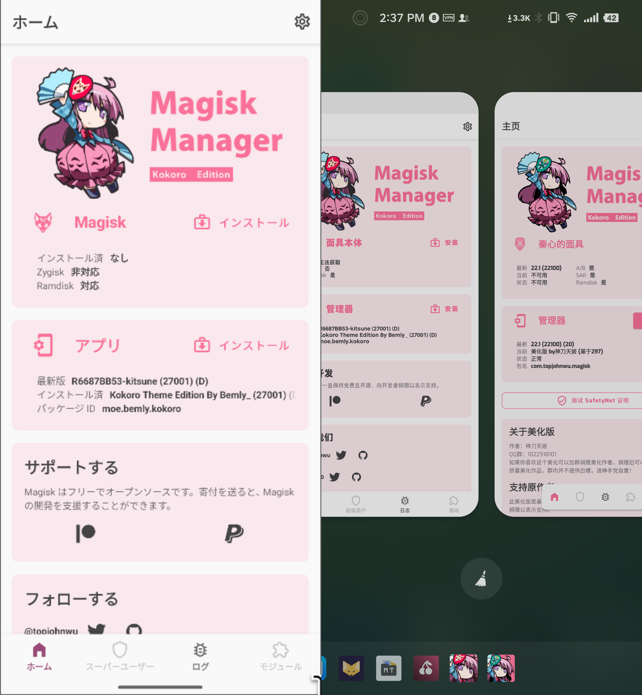

# Kitsune(Magisk Delta) Kokoro Edition

#### This is not an officially supported Google product

Note: This beautified version only modifies the appearance of the `Magisk APP`.
The usage and functionality are identical to the original version.
If you need more stable features, please use the [***official original version***](https://github.com/HuskyDG/magisk-files).

Warning: This Magisk is always built using the `Canary` channel,
so instability will be common! Since the default package name has been modified,
some modules that rely on the default package name for identification may not work properly!

## Magisk Documentation

- [Installation Instructions](docs/install.md)
- [Frequently Asked Questions](docs/faq.md)
- [Release Notes](docs/releases/index.md)
- [Magisk Changelog](docs/changes.md)

The following sections are for developers

- [Building and Developing Magisk](docs/build.md) (for developing Magisk itself)
- [Developer Guides](docs/guides.md) (for developers **using** Magisk)
- [Magisk Tools](docs/tools.md)
- [Internal Details](docs/details.md)
- [Android Booting Shenanigans](docs/boot.md)

## How use

- Kitsune(delta) version : [Download 27001A version](https://github.com/Bemly/kokoro-no-kitsune/releases/download/27001a/app-release.apk)
- Magisk version : [@missingpower](https://t.me/missingpower)

## the Original README

https://github.com/Bemly/kokoro-no-kitsune/blob/kitsune/README.old.MD

## 面具 车万秦心特供版

- 动机：个人用过的最好康的主题，但是作者捏在2021年弃坑了，然后我就把她捡起来然后移植到Magisk delta上面来惹（
- 注意：本面具始终采用`Canary`通道进行构建，不稳定情况会很多！由于修改了默认包名，一些依靠面具本体包名识别的模块将无法正常工作！

### 新老版本对比

- 老版本作者及下载地址：[@神刀天姬](https://t.me/missingpower)（基于 `Magisk` 原版）
- 新版本作者及下载地址：[本仓库](#如何安装) （基于 `Magisk delta(Kitsune)`）

### 如何安装

 前往：https://github.com/Bemly/kokoro-no-kitsune/releases/ 下载
      
 须知：此美化版仅修改了 `Magisk APP` 的外观，使用方法和功能与原版完全相同。如果你需要更稳定的功能，请使用***官方原版***

### 如何构建

本项目使用`Android Studio`构建，具体教程参见官方文档：[Building and Developing Magisk](docs/README.md)

### Kitsune 原版README

https://github.com/Bemly/kokoro-no-kitsune/blob/kitsune/README.old.MD

